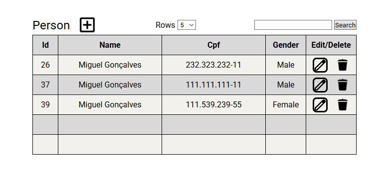

# Teste-de-Back-End-da-Magazord - v1.0.0

Teste de seleção da Magazord.
Projeto desenvolvido em PHP, que permite o cadastro e
consulta de pessoas e contatos.

## Preview



- [Instalação manual](#instalação-manual)
- [Instalação via Docker](#instalação-via-docker)

## O que há de novo nesta atualização?

- Versão estável;
- Edição de dados.

## Requisitos

- Banco de Dados: PostgreSQL ou MySQL;
- PHP 8.4 ou superior (compatível com versões 8.x);
- Composer 2.8.8 ou superior (compatível com versões 2.x);
- Extensões PHP obrigatórias:
    - `json` (para codificação e decodificação de dados)
    - `pdo` e `pdo_pgsql` (para acesso ao banco de dados)

## Instalação Manual

1. **Clone o repositório:**

    ```bash
    git clone https://github.com/Miguelw15/Teste-de-Back-End-da-Magazord.git

    cd Teste-de-Back-End-da-Magazord
    ```

2. **Instale as dependências:**

    ```bash
    composer install
    ```

3. **Configure o arquivo ".env"**
    Renomeie cada um deles para sua configuração desejada.

    ```bash
    DB_HOST=localhost
    DB_PORT=5432
    DB_DRIVER=pdo_pgsql
    DB_NAME=meu_banco
    DB_USER=postgres
    DB_PASSWORD=admin
    ```

4. **Crie o Schema com:**

    ```bash
    php console.php orm:schema-tool:create
    ```

5. **Execute:**

    ```bash
    php -S localhost:8080 -t public/
    ```

## Instalação via Docker

1. **Clone o repositório:**

    ```bash
    git clone https://github.com/Miguelw15/Teste-de-Back-End-da-Magazord.git

    cd Teste-de-Back-End-da-Magazord
    ```

2. **Execute:**

    ```bash
    docker-compose up
    ```

3. **Acesse esta URL:**

- [localhost:8080](http://localhost:8080)

